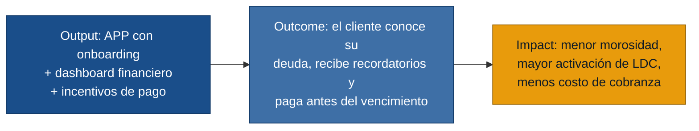
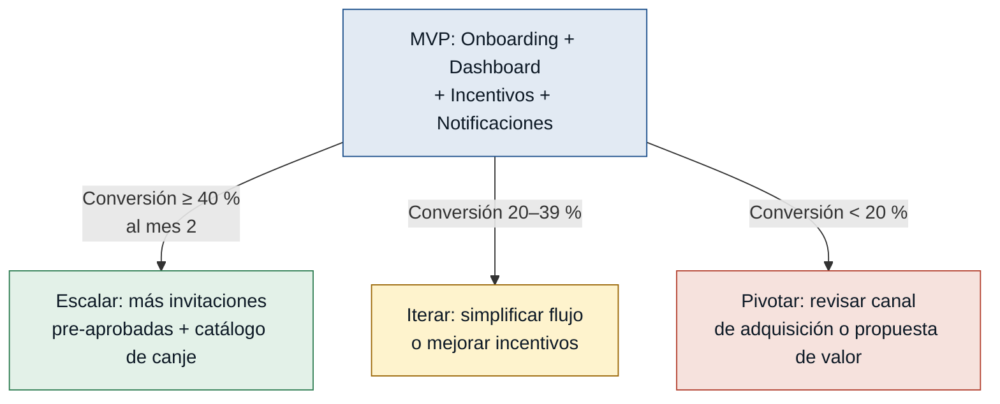

# MVP Canvas — APP Resuelve

> **Advertencia de evidencia:** generado con 1 sola fuente de entrevista
> (`Entrevistas_APP_Resuelve.md`). El gate de readiness exige 2; se procedió
> con autorización explícita. Triangular con una segunda entrevista antes de
> comprometer desarrollo.

---

## Cadena de valor

---

## Canvas

| Bloque | Contenido |
|---|---|
| **Propuesta de valor** | La APP que permite al cliente de Resuelve solicitar su línea de crédito, visualizar su deuda en tiempo real y recibir incentivos concretos para pagar a tiempo — todo desde el celular, en pasos simples, rápidos y seguros. |
| **Segmento de usuarios** | Clientes pre-aprobados de Resuelve que aún no activaron su línea de crédito; y clientes activos que hoy gestionan su cuenta de forma manual (llamadas, sucursales). |
| **Funcionalidades mínimas** | 1. Onboarding: verificación de cédula + OTP + creación de contraseña (US-01 a US-04). 2. Solicitud de crédito pre-aprobado en 3 pasos (US-02). 3. Dashboard personalizado con resumen financiero (US-08). 4. Estado de cuenta: cuota al cobro, fecha mínima de pago (US-09). 5. Incentivos: gráfico de progreso + modal de premio (US-10, US-11). 6. Notificaciones push de fecha de pago (US-12). 7. Autenticación (login + recuperación de contraseña) y gestión de sesión (US-06, US-07, US-13). |
| **Resultado esperado (outcome)** | El cliente conoce su deuda exacta y su fecha límite sin ir a una sucursal, recibe un recordatorio proactivo y siente motivación visible para pagar antes del vencimiento gracias al sistema de incentivos. |
| **Métrica de éxito** | **Tasa de conversión de onboarding:** porcentaje de clientes pre-aprobados invitados que completan el registro y activan su línea de crédito en la APP dentro de los 7 días de recibir la invitación. Objetivo: ≥ 40 % al final del mes 2 de lanzamiento. *(Prueba ácida: si esta tasa sube al 40 %, Resuelve puede aumentar el volumen de invitaciones pre-aprobadas y proyectar mayor cartera activa — decisión de negocio real.)* |
| **Riesgos / supuestos** | 1. Los clientes pre-aprobados tienen smartphone con datos y están dispuestos a instalar la APP. 2. El programa de incentivos (gráfico de progreso + premios) cambia el comportamiento de pago. 3. El flujo de 3 pasos es suficientemente simple para no generar abandono. 4. La integración con el backend de Resuelve (verificación de cédula, OTP, persistencia) es estable en producción. 5. El cliente distingue y actúa ante las notificaciones push de pago. |
| **Fuera de alcance (por ahora)** | Catálogo de canje y redención de puntos (US-022 a US-031) — flujo complejo, alto riesgo técnico y de UX; se valida primero si el cliente paga a tiempo antes de añadir recompensas. Autenticación biométrica (US-013) — depende de adopción; no es bloqueante del core. Selección de modelo de tarjeta (US-017) — cosmético, no aporta al outcome. Gestión completa de perfil (US-032, US-033, US-034) — no es crítico para el primer ciclo de pago. Banner administrable desde back-office (US-038) — requiere entrevista de primera mano con el administrador (pendiente). Historial completo de movimientos (US-021) — el estado de cuenta cubre la necesidad inmediata. Accesibilidad WCAG completa (US-039) — objetivo de calidad a planificar para V2. |

---

## Árbol de decisión del MVP

