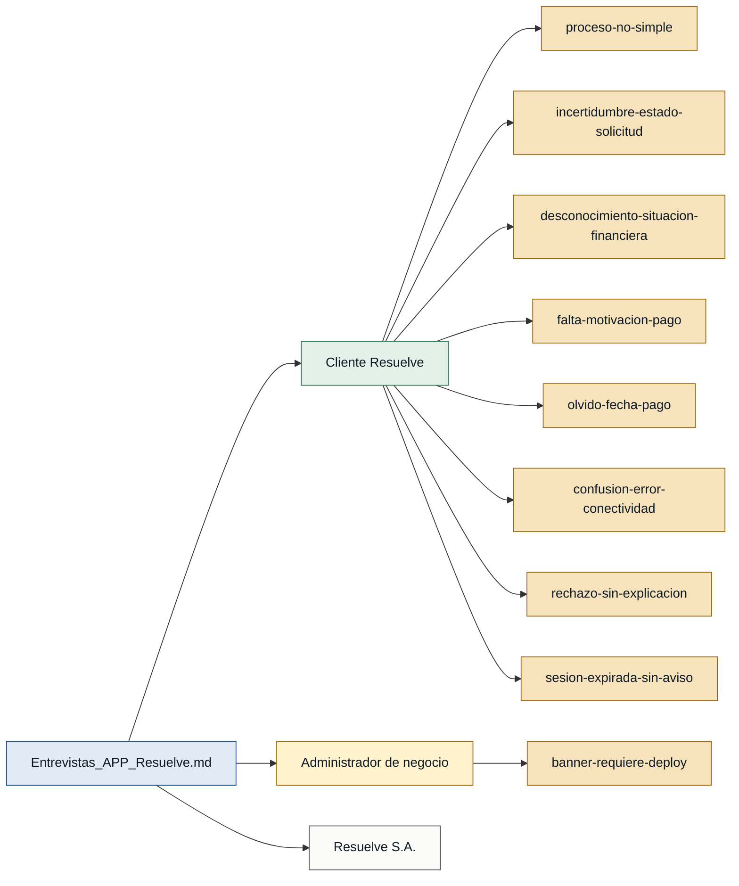

# Personas y Stakeholders — APP Resuelve

> Fuente única de evidencia: `Entrevistas_APP_Resuelve.md`
> Nota metodológica: el archivo es un documento generado a partir de historias de usuario del backlog, no de sesiones de entrevista con usuarios reales. El frontmatter declara `primera_persona: true` y `rol_entrevistado: cliente APP Resuelve`, por lo que el rol de cliente tiene respaldo de primera mano formal. Sin embargo, la profundidad emocional y contextual típica de una entrevista real es limitada en este documento.

---

## Personas

### Cliente Resuelve — usuario de la APP

- **Contexto:** Persona que tiene o aspira a tener una línea de crédito con Resuelve y gestiona su relación financiera a través de la aplicación móvil. Puede estar en distintos estados: cliente nuevo, cliente pre-aprobado, cliente con LDC activa o inactiva, cliente frecuente.
- **Objetivo principal:** Gestionar su crédito, consultar su estado de cuenta, pagar a tiempo y canjear puntos de forma simple, rápida y segura desde el celular.
- **Dolores:**
  - El proceso no resulta simple, rápido o seguro, lo que afecta su experiencia y lo lleva a abandonar el flujo. (Entrevistas_APP_Resuelve.md — presente en todas las historias US-001 a US-039)
  - No sabe si debe esperar o tomar alguna acción mientras su solicitud está en revisión. (Entrevistas_APP_Resuelve.md · US-005)
  - No tiene visibilidad inmediata de su situación financiera al ingresar a la APP. (Entrevistas_APP_Resuelve.md · US-016)
  - No recibe motivación ni estímulo para pagar a tiempo. (Entrevistas_APP_Resuelve.md · US-019)
  - Olvida la fecha de pago y necesita recordatorios. (Entrevistas_APP_Resuelve.md · US-037)
  - No sabe si la APP falló o si es un problema de conectividad cuando no hay internet. (Entrevistas_APP_Resuelve.md · US-036)
  - Recibe rechazo de su solicitud o canje sin una explicación clara de qué hacer. (Entrevistas_APP_Resuelve.md · US-004, US-031)
  - Su sesión expira sin aviso, dejando su información desprotegida. (Entrevistas_APP_Resuelve.md · US-035)
- **Respaldo:** `primera mano` (Entrevistas_APP_Resuelve.md · frontmatter: `primera_persona: true`, `rol_entrevistado: cliente`)

---

### Administrador de negocio — gestor del back-office

- **Contexto:** Persona de la empresa Resuelve que administra el contenido visible en la APP (p. ej. banners publicitarios) desde un panel de administración, sin intervención del equipo técnico.
- **Objetivo principal:** Actualizar el contenido de la APP de forma autónoma y sin necesidad de publicar una nueva versión de la aplicación.
- **Dolores:**
  - Para cambiar el banner de la APP actualmente necesita publicar una nueva versión, lo que genera dependencia del equipo técnico y retrasos. (Entrevistas_APP_Resuelve.md · US-038)
- **Respaldo:** `referenciada` — aparece mencionado en US-038 dentro del archivo cuyo `rol_entrevistado` es `cliente APP Resuelve`. No existe entrevista propia de este rol.

---

## Stakeholders

### Resuelve S.A. (empresa / negocio)

- **Interés en el sistema:** Fortalecer la identidad de marca desde el primer contacto con el cliente, mejorar la tasa de conversión del proceso de onboarding y solicitud de crédito, incrementar la fidelización a través del programa de puntos, y mantener el control sobre el contenido de la APP sin depender de releases técnicos.
- **Fuente:** Entrevistas_APP_Resuelve.md (US-001 identidad de marca, US-019 programa de beneficios, US-038 gestión de contenido desde back-office)

---

## Mapa de trazabilidad

> **Leyenda:** verde = primera mano · ámbar = referenciada
