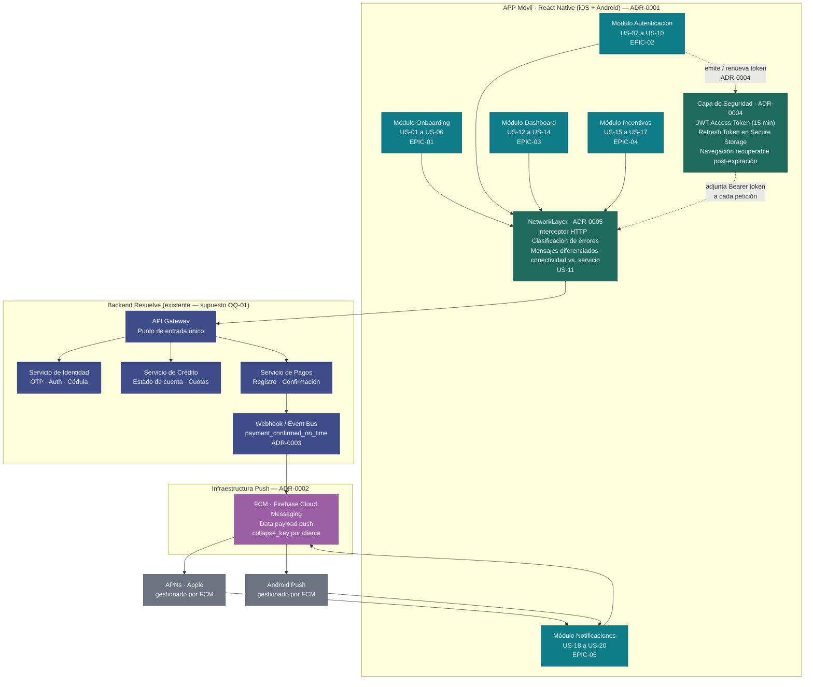

# Arquitectura — APP Resuelve

> **Fecha:** 2026-06-24 · **Architect:** rol Architect del Agile Delivery Team
>
> **Scope:** MVP definido en `epics.md` — Onboarding (EPIC-01), Autenticación
> (EPIC-02), Dashboard (EPIC-03), Incentivos (EPIC-04) y Notificaciones Push
> (EPIC-05). 20 historias de usuario, 60 puntos de historia. Las decisiones aquí
> registradas se toman sobre ese scope y NO anticipan capacidades futuras (catálogo
> de canje, biometría, back-office).

---

## Decisiones clave

| ADR | Decisión | Fuerza que la motiva |
|---|---|---|
| ADR-0001 | Plataforma React Native (iOS + Android) | Alcance cross-platform con una sola base de código para el MVP de validación rápida (`mvp-canvas.md → Segmento de usuarios`) |
| ADR-0002 | Push: FCM como capa unificada | OQ-02 del backlog — necesidad de US-18, US-19, US-20 sin infraestructura propia |
| ADR-0003 | "Pagó a tiempo": evento webhook del backend → FCM | OQ-04 — R-20 exige notificación inmediata de premio; descarta polling |
| ADR-0004 | Autenticación JWT con access token (15 min) + refresh token (7 días) | US-07, US-09, US-10, US-19 — logout real + sesión fluida + navegación recuperable post-expiración |
| ADR-0005 | Capa transversal `NetworkLayer` con mensajes diferenciados; sin caché offline de datos financieros | R-36, R-41, US-11, pain `confusion-error-conectividad` — el cliente no distingue error de red vs. fallo del servicio |

---

## Diagrama de componentes

---

## Capas y responsabilidades

### 1. APP Móvil — React Native (ADR-0001)

Plataforma única para iOS y Android. Organizada en módulos funcionales alineados
1-a-1 con las épicas del backlog. No tiene lógica de negocio propia: orquesta
peticiones al API Gateway a través del `NetworkLayer` y presenta el estado.

| Módulo / Capa | Historias | Responsabilidad |
|---|---|---|
| Onboarding | US-01 a US-06 | Flujo de registro, verificación OTP, solicitud de crédito pre-aprobada, estados de solicitud |
| Autenticación | US-07 a US-10 | Login, recuperación de contraseña, cierre de sesión, aviso de sesión expirada |
| Dashboard | US-12 a US-14 | Presentación del resumen financiero, indicador de pago próximo |
| Incentivos | US-15 a US-17 | Gráfico de progreso, modal de celebración, actualización de nivel |
| Notificaciones | US-18 a US-20 | Recepción de push (FCM), deep link a estado de cuenta, supresión post-pago |
| NetworkLayer | US-11 (transversal) | Intercepta todas las llamadas HTTP, clasifica errores (red vs. servicio), ofrece reintento contextual. Sin caché de datos financieros. |
| Capa de Seguridad | US-07, US-09, US-10, US-19 (transversal) | Almacenamiento seguro de JWT, renovación silenciosa de access token, invalidación de refresh token al logout, guardado de ruta de destino para recuperación post-expiración |

### 2. API Gateway de Resuelve (existente)

Punto de entrada único al backend financiero. La APP solo conoce este endpoint.
El routing interno (identidad, crédito, pagos) es responsabilidad del backend.

> **Supuesto crítico (OQ-01):** El backend expone contratos de API estables para
> verificación de cédula, OTP, estado de solicitud, estado de cuenta y registro de
> pagos. Debe validarse con el equipo técnico de Resuelve antes del Sprint 1. Si
> no hay contrato formal, el equipo construye mocks hasta que estén disponibles.
> El contrato debe incluir: endpoint de revocación de refresh token (ADR-0004),
> evento `payment_confirmed_on_time` con payload de niveles (ADR-0003), y códigos
> de error de negocio clasificables por el NetworkLayer (ADR-0005).

### 3. Infraestructura Push — FCM (ADR-0002)

Firebase Cloud Messaging actúa como abstracción unificada: la APP registra un
device token en FCM; el backend de Resuelve envía notificaciones y data payloads
a FCM; FCM los entrega a APNs (iOS) o directamente al dispositivo Android. La APP
no necesita lógica diferente por plataforma para recibir push.

El `collapse_key: payment_{client_id}` permite que el push silencioso de
confirmación de pago (ADR-0003) sobreescriba el push de recordatorio programado
si aún no fue entregado, implementando US-20 sin una llamada de cancelación
explícita.

### 4. Autenticación — JWT con Refresh Token (ADR-0004)

- **Access token:** 15 minutos. En memoria de la APP (no en disco). Adjunto en
  cada petición al API Gateway a través del `NetworkLayer`.
- **Refresh token:** 7 días. En Secure Storage del dispositivo (Keychain iOS /
  Keystore Android). Al expirar el access token, la APP lo renueva silenciosamente.
- **Logout (US-09):** el refresh token se invalida en el servidor via lista negra.
- **Sesión expirada (US-10):** cuando el refresh token vence, la APP guarda la
  ruta de destino y redirige al login; tras re-autenticarse, restaura la navegación.
- **Deep link post-expiración (US-19):** mismo mecanismo: la ruta `account_status`
  se guarda antes del redirect al login.
- **Lockout (US-07):** el servidor lleva el contador; la APP muestra el mensaje y
  bloquea el botón durante el tiempo indicado.

### 5. Evento de "pagó a tiempo" — Webhook del backend (ADR-0003)

Cuando el Servicio de Pagos confirma un pago antes de la fecha mínima, emite un
evento `payment_confirmed_on_time` con `{ client_id, amount, level_previous, level_reached }`.
El Webhook / Event Bus llama a FCM con un data payload silencioso. La APP:

- Muestra el modal de celebración con imagen del premio (US-16) si `level_reached`
  > `level_previous`.
- Actualiza el gráfico de progreso con el nuevo nivel (US-17).
- El `collapse_key` de FCM cancela el push de recordatorio pendiente (US-20).

La APP no hace polling. La resiliencia ante push no entregado (US-16 con red
interrumpida) se deja para Sprint 2 (consulta de estado al abrir la APP).

### 6. Capa NetworkLayer — Manejo de errores de conectividad (ADR-0005)

Interceptor HTTP transversal que todos los módulos usan. Distingue:
- **Error de red** (timeout, sin IP): mensaje "Sin conexión a internet" + botón
  de reintento en contexto.
- **Error de servicio** (HTTP 5xx): mensaje "Servicio no disponible" + botón de
  reintento.
- **Error de negocio** (HTTP 4xx): mensaje específico de la operación (ej. "OTP
  incorrecto").

No almacena datos financieros en caché offline. El historial completo de
movimientos está fuera del scope del MVP (`mvp-canvas.md → Fuera de alcance`), por
lo que no hay justificación para persistencia local compleja.

---

## ADRs de este delivery

| ADR | Decisión | Estado |
|---|---|---|
| ADR-0001 | Plataforma móvil: React Native (iOS + Android) | aceptado |
| ADR-0002 | Push: FCM como capa unificada de notificaciones | aceptado |
| ADR-0003 | "Pagó a tiempo": webhook del backend + data payload FCM | aceptado |
| ADR-0004 | Auth: JWT con access token (15 min) + refresh token (7 días) | aceptado |
| ADR-0005 | Errores de conectividad: NetworkLayer transversal sin caché offline | aceptado |

---

## Justificación de valor y simplicidad

Esta arquitectura es la más simple que sostiene las 20 historias del MVP:

1. **Un solo canal de salida al backend (API Gateway):** todos los módulos hablan
   con un endpoint; la APP no necesita conocer la topología interna del backend
   de Resuelve.
2. **FCM como única dependencia de infraestructura nueva:** el único servicio
   externo que la APP agrega es Firebase, que es gratuito, maduro y necesario para
   las 3 historias de notificaciones.
3. **JWT con refresh token es el patrón estándar del sector financiero móvil:**
   no requiere sesión stateful en el servidor más allá de una lista negra liviana.
4. **NetworkLayer centralizado:** un solo lugar para cambiar los mensajes de error,
   lo que asegura consistencia (R-41) sin duplicar lógica en cada pantalla.
5. **Sin persistencia offline de datos financieros:** elimina toda la complejidad
   de sincronización, invalidación de caché y conflictos. Los datos que el MVP
   requiere (saldo, cuota, fecha de pago) necesitan estar siempre actualizados
   para ser útiles; una caché obsoleta haría daño, no bien.

La métrica de éxito del producto (≥ 40 % de conversión de onboarding en 7 días,
`mvp-canvas.md → Métrica de éxito`) no requiere ninguna de las capacidades
excluidas. Las decisiones arquitectónicas del MVP no bloquean las iteraciones
futuras más probables: el catálogo de canje podría añadirse como un módulo nuevo
sin modificar los módulos existentes; la biometría es una alternativa de login que
no toca la estrategia JWT.

---

## Fuera de alcance arquitectónico (MVP)

| Ítem | Razón | Cuándo revisar |
|---|---|---|
| Autenticación biométrica (Face ID / huella, R-13) | Fuera de scope MVP (`mvp-canvas.md → Fuera de alcance`). Depende de adopción. | V2 si conversión ≥ 40 % |
| Catálogo de canje y redención de puntos (R-22 a R-31) | Alto riesgo técnico y de UX. El MVP valida primero si el cliente paga a tiempo antes de añadir recompensas. | Tras validar outcome de incentivos |
| Banner administrable desde back-office (R-38) | Pendiente entrevista directa con Administrador (OQ-05). `mvp-canvas.md` lo excluye explícitamente. | Siguiente ciclo de discovery |
| Historial completo de movimientos (R-21) | El estado de cuenta (US-13) cubre la necesidad inmediata del MVP. Historial completo añadiría necesidad de caché local compleja. | V2 |
| Persistencia offline de datos financieros (SQLite / caché local) | No hay historia MVP que requiera datos disponibles sin red más allá del bundle estático. ADR-0005 lo decide explícitamente. | Si el historial de movimientos entra en scope en V2 |
| Contrato formal de API con backend Resuelve | Depende de OQ-01. La arquitectura asume que existe; si no, se construyen mocks. | Antes del Sprint 1 — bloqueante |
| Motor de niveles de incentivos (umbrales y tipos de premio) | OQ-03: decisión de negocio, no técnica. La arquitectura soporta cualquier definición que entregue el backend como payload. | Antes de refinar US-15/US-16 en sprint |
| WebSocket / tiempo real persistente | Evento de pago es de baja frecuencia (un pago por mes); el push FCM es suficiente. | Solo si aparecen casos de uso de alta frecuencia |

---

## Open Questions arquitectónicas pendientes

| OQ | Impacto técnico | Bloqueante para |
|---|---|---|
| **OQ-01** — ¿El backend de Resuelve expone APIs estables con contratos definidos para cédula, OTP, estado de cuenta, pagos y revocación de refresh token? | Define si el equipo puede construir sobre APIs reales o necesita mocks en Sprint 1. | Sprint 1 completo |
| **OQ-03** — ¿Cuántos niveles tiene el motor de incentivos, cuáles son los umbrales y los tipos de premio del MVP? | El payload del evento `payment_confirmed_on_time` (ADR-0003) debe incluir `level_reached` con un valor que la APP sepa interpretar. | US-15, US-16 en sprint |
| **OQ-04 (parcialmente resuelta)** — ADR-0003 decide que el backend dispara el evento; pendiente confirmar con el equipo de Resuelve que la implementación del Webhook / Event Bus es viable en el Sprint 1. | Si el backend no puede implementar el evento en Sprint 1, US-16 y US-20 quedan bloqueados. | US-16, US-20 |
| **OQ-05** — ¿El Administrador de negocio (back-office / banner) es stakeholder del MVP actual? | Si entra en scope, requiere un nuevo componente de administración no representado en la arquitectura actual. | Fuera de MVP por ahora |
