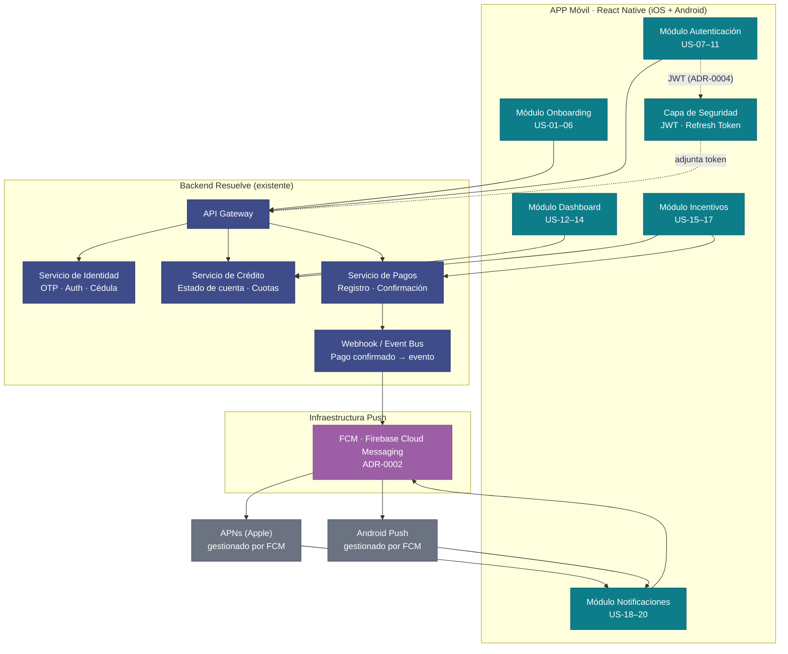

# Arquitectura — APP Resuelve

> **Fecha:** 2026-06-20 · **Architect:** rol Architect del Agile Delivery Team
>
> **Scope:** MVP definido en `epics.md` — Onboarding, Autenticación, Dashboard,
> Incentivos y Notificaciones Push. Las decisiones aquí registradas se toman sobre
> ese scope y NO anticipan capacidades futuras (catálogo de canje, biometría,
> back-office).

---

## Contexto del sistema

APP Resuelve es una aplicación móvil que sirve a dos segmentos de usuario
(clientes pre-aprobados y clientes activos de Resuelve) para gestionar su línea de
crédito desde el celular. El sistema no construye el backend financiero de Resuelve
— este ya existe y expone APIs (supuesto crítico: OQ-01). La APP es un canal
nuevo que consume esas APIs y añade una capa de incentivos y notificaciones.

El principio rector de esta arquitectura es **valor sobre complejidad**: elegir la
opción más simple que sostenga los 20 historias del MVP sin bloquear las
iteraciones futuras más probables (activar catálogo de canje, biometría).

---

## Diagrama de componentes

---

## Capas y responsabilidades

### 1. APP Móvil — React Native (ADR-0001)

Plataforma única para iOS y Android. Organizada en módulos funcionales
alineados 1-a-1 con las épicas del backlog. No tiene lógica de negocio propia:
orquesta peticiones al API Gateway y presenta el estado.

| Módulo | Historias | Responsabilidad |
|---|---|---|
| Onboarding | US-01–06 | Flujo de registro, verificación OTP, solicitud de crédito |
| Autenticación | US-07–11 | Login, recuperación de contraseña, gestión de sesión JWT, mensajes de conectividad |
| Dashboard | US-12–14 | Presentación del resumen financiero y alertas de pago próximo |
| Incentivos | US-15–17 | Gráfico de progreso, modal de celebración, actualización de nivel |
| Notificaciones | US-18–20 | Recepción de push (FCM), deep link a estado de cuenta, supresión post-pago |
| Capa de Seguridad | transversal | Almacenamiento seguro de JWT, renovación de token, cierre de sesión |

### 2. API Gateway de Resuelve (existente)

Punto de entrada único al backend financiero. La APP solo conoce este endpoint.
El routing interno (identidad, crédito, pagos) es responsabilidad del backend.

> **Supuesto crítico (OQ-01):** El backend expone contratos de API estables.
> Este supuesto debe validarse con el equipo técnico de Resuelve antes del
> Sprint 1. Si no hay contrato, el equipo debe construir mocks hasta que esté
> disponible.

### 3. Infraestructura Push — FCM (ADR-0002)

Firebase Cloud Messaging actúa como abstracción unificada: la APP registra un
device token en FCM; el backend de Resuelve envía notificaciones a FCM; FCM las
entrega a APNs (iOS) o directamente al dispositivo Android. La APP no necesita
lógica diferente por plataforma para recibir push.

### 4. Autenticación — JWT con Refresh Token (ADR-0004)

- **Access token:** corto (15 min). Adjunto en cada petición al API Gateway.
- **Refresh token:** largo (7 días). Almacenado en Secure Storage del dispositivo.
  Al expirar el access token, la APP lo renueva silenciosamente. Al hacer logout
  (US-09), el refresh token se invalida en el servidor.
- **Lockout (US-07):** el servidor lleva el contador de intentos fallidos; la APP
  muestra el mensaje y bloquea el botón de login durante el tiempo indicado.
- **Sesión expirada (US-10):** cuando el refresh token vence, la APP redirige al
  login y restaura la navegación posterior.

### 5. Evento de "pago a tiempo" — Webhook del backend (ADR-0003)

Cuando el Servicio de Pagos confirma un pago realizado antes de la fecha mínima,
dispara un evento al Event Bus interno. Este bus:
- Notifica a FCM para enviar un push con payload `{ type: "payment_confirmed" }`.
- La APP, al recibir el push, muestra el modal de celebración (US-16) o suprime la
  notificación de recordatorio programada (US-20).

---

## ADRs de este delivery

| ADR | Decisión | Resuelve |
|---|---|---|
| ADR-0001 | Plataforma móvil: React Native | Alcance cross-platform con velocidad de MVP |
| ADR-0002 | Push: FCM como capa unificada | OQ-02 del backlog |
| ADR-0003 | "Pagó a tiempo": webhook del backend | OQ-04 del backlog |
| ADR-0004 | Auth: JWT con refresh token | US-07, US-09, US-10 (lockout, logout, sesión expirada) |

---

## Qué se decidió NO hacer todavía

| Ítem | Razón | Cuándo revisar |
|---|---|---|
| Autenticación biométrica (Face ID / huella) | Fuera de scope MVP (mvp-canvas.md). Depende de adopción. | V2 si conversión ≥ 40 % |
| Catálogo de canje / redención de puntos | Alto riesgo técnico y de UX. El MVP valida primero si el cliente paga a tiempo. | Tras validar outcome de incentivos |
| Banner administrable desde back-office | Pendiente entrevista directa con Administrador (OQ-05). | Siguiente ciclo de discovery |
| SQLite / persistencia relacional local | AsyncStorage es suficiente para el MVP. SQLite solo si el historial completo de movimientos entra en scope. | V2 |
| Contrato de API con backend Resuelve | Depende de OQ-01. Arquitectura asume que existe; si no, se construyen mocks. | Antes del Sprint 1 |
| Definición de niveles del motor de incentivos | OQ-03: decisión de negocio, no técnica. | Antes de refinar US-15/US-16 en sprint |
