# Épicas — APP Resuelve

## Resumen

APP Resuelve es una aplicación móvil que permite a los clientes de Resuelve
activar su línea de crédito, visualizar su situación financiera en tiempo real y
recibir incentivos concretos para pagar antes del vencimiento. El backlog prioriza
el flujo completo de conversión —onboarding → dashboard → incentivos → notificaciones—
maximizando la métrica de negocio: ≥ 40 % de tasa de conversión en los primeros
7 días de invitación.

> **Advertencia de evidencia heredada del inbox:** el discovery se realizó con
> 1 sola fuente de entrevista. Triangular con una segunda entrevista antes de
> comprometer desarrollo.

---

## Épicas

### EPIC-01: Onboarding e Identificación de Cliente
**Valor:** Convierte a los clientes pre-aprobados invitados en usuarios activos con
cuenta creada y línea de crédito en trámite. Sin este flujo no hay producto. Es el
gate directo a la métrica de éxito del MVP (≥ 40 % de conversión en 7 días).

**Origin:**
- `mvp-canvas.md` → Funcionalidades mínimas ítems 1 y 2 (onboarding, solicitud en 3 pasos)
- `mvp-canvas.md` → Métrica de éxito: tasa de conversión de onboarding
- `user-stories.md` → US-01, US-02, US-03, US-04, US-05
- `requisitos.md` → R-01, R-02, R-03, R-04, R-05, R-06, R-07, R-08, R-09, R-10, R-11
- `evidence-map.json` → pains: `proceso-no-simple`, `incertidumbre-estado-solicitud`, `rechazo-sin-explicacion`
- `personas.md` → Cliente Resuelve (pre-aprobado / nuevo)

**Historias candidatas:**
- HC-01-01: Pantalla de bienvenida con video de marca Resuelve
- HC-01-02: Verificación de cédula y clasificación del flujo del cliente
- HC-01-03: Visualización de oferta de crédito pre-aprobado y solicitud en 3 pasos
- HC-01-04: Registro de datos personales con validación OTP
- HC-01-05: Creación de contraseña y confirmación de cuenta
- HC-01-06: Consulta del estado de solicitud en revisión

---

### EPIC-02: Autenticación y Seguridad de Sesión
**Valor:** Habilita el acceso recurrente y seguro a la APP. Sin autenticación el
cliente no puede regresar tras el registro ni mantener su sesión protegida. Es un
habilitador transversal requerido por todas las épicas posteriores.

**Origin:**
- `mvp-canvas.md` → Funcionalidades mínimas ítem 7 (autenticación + gestión de sesión)
- `user-stories.md` → US-06, US-07, US-13
- `requisitos.md` → R-12, R-14, R-15, R-35, R-36, R-40, R-41
- `evidence-map.json` → pains: `sesion-expirada-sin-aviso`, `confusion-error-conectividad`, `rechazo-sin-explicacion`
- `personas.md` → Cliente Resuelve (frecuente)

**Historias candidatas:**
- HC-02-01: Inicio de sesión con cédula y contraseña
- HC-02-02: Recuperación de contraseña por correo registrado
- HC-02-03: Cierre de sesión desde cualquier pantalla
- HC-02-04: Aviso y redirección al login cuando la sesión expira
- HC-02-05: Mensajes diferenciados para error de conectividad vs. servicio no disponible

---

### EPIC-03: Dashboard y Visibilidad Financiera
**Valor:** Entrega el outcome principal del MVP: el cliente conoce su deuda exacta
y su fecha límite sin ir a una sucursal. Transforma la APP en un canal de
autoservicio financiero real y reduce la dependencia de asesores y sucursales.

**Origin:**
- `mvp-canvas.md` → Funcionalidades mínimas ítems 3 y 4 (dashboard, estado de cuenta)
- `mvp-canvas.md` → Resultado esperado: "el cliente conoce su deuda exacta y su fecha límite"
- `user-stories.md` → US-08, US-09
- `requisitos.md` → R-16, R-18
- `evidence-map.json` → pain: `desconocimiento-situacion-financiera`
- `personas.md` → dolor: "No tiene visibilidad inmediata de su situación financiera al ingresar"

**Historias candidatas:**
- HC-03-01: Dashboard con saludo personalizado y resumen de crédito disponible
- HC-03-02: Estado de cuenta con cuota al cobro, cuota consumida y fecha mínima de pago
- HC-03-03: Indicador visual destacado de pago próximo en el dashboard

---

### EPIC-04: Incentivos de Pago y Motivación
**Valor:** Convierte la visibilidad financiera en comportamiento de pago. El sistema
de incentivos (gráfico de progreso + modal de premio) es el diferenciador que mueve
el outcome (cliente conoce su deuda) al impacto de negocio (menor morosidad, mayor
activación de LDC).

**Origin:**
- `mvp-canvas.md` → Funcionalidades mínimas ítems 5 (incentivos), cadena de valor: Impact "menor morosidad"
- `mvp-canvas.md` → Riesgos/supuestos: "El programa de incentivos cambia el comportamiento de pago"
- `user-stories.md` → US-10, US-11
- `requisitos.md` → R-19, R-20
- `evidence-map.json` → pain: `falta-motivacion-pago`
- `personas.md` → dolor: "No recibe motivación ni estímulo para pagar a tiempo"

**Historias candidatas:**
- HC-04-01: Gráfico de progreso con niveles de beneficio según comportamiento de pago
- HC-04-02: Modal de celebración con nombre e imagen del premio al pagar a tiempo
- HC-04-03: Actualización del nivel en el gráfico de progreso tras recibir el premio

---

### EPIC-05: Notificaciones Push de Pago
**Valor:** Multiplica el efecto de los incentivos cerrando el ciclo de
comportamiento: recuerdo proactivo → pago a tiempo → recompensa. Ataca directamente
el dolor más reportado (olvido de fecha de pago) y reduce el costo de cobranza de
Resuelve.

**Origin:**
- `mvp-canvas.md` → Funcionalidades mínimas ítem 6 (notificaciones push)
- `user-stories.md` → US-12
- `requisitos.md` → R-37
- `evidence-map.json` → pain: `olvido-fecha-pago`
- `personas.md` → dolor: "Olvida la fecha de pago y necesita recordatorios"

**Historias candidatas:**
- HC-05-01: Notificación push con monto y fecha 5 días antes del vencimiento
- HC-05-02: Deep link desde la notificación al estado de cuenta
- HC-05-03: Supresión de la notificación cuando el cliente ya pagó

---

## Diagrama de backlog (Mermaid)

```mermaid
graph TD
  P[APP Resuelve] --> E1[EPIC-01: Onboarding e Identificación]
  P --> E2[EPIC-02: Autenticación y Sesión]
  P --> E3[EPIC-03: Dashboard y Visibilidad Financiera]
  P --> E4[EPIC-04: Incentivos de Pago]
  P --> E5[EPIC-05: Notificaciones Push]

  E1 --> HC0101[HC-01-01: Pantalla de bienvenida]
  E1 --> HC0102[HC-01-02: Verificación de cédula]
  E1 --> HC0103[HC-01-03: Oferta pre-aprobada en 3 pasos]
  E1 --> HC0104[HC-01-04: Datos personales + OTP]
  E1 --> HC0105[HC-01-05: Creación de contraseña]
  E1 --> HC0106[HC-01-06: Estado de solicitud]

  E2 --> HC0201[HC-02-01: Login cédula + contraseña]
  E2 --> HC0202[HC-02-02: Recuperación de contraseña]
  E2 --> HC0203[HC-02-03: Cierre de sesión]
  E2 --> HC0204[HC-02-04: Sesión expirada con aviso]
  E2 --> HC0205[HC-02-05: Mensajes de conectividad]

  E3 --> HC0301[HC-03-01: Dashboard personalizado]
  E3 --> HC0302[HC-03-02: Estado de cuenta detallado]
  E3 --> HC0303[HC-03-03: Indicador de pago próximo]

  E4 --> HC0401[HC-04-01: Gráfico de progreso]
  E4 --> HC0402[HC-04-02: Modal de celebración]
  E4 --> HC0403[HC-04-03: Actualización de nivel]

  E5 --> HC0501[HC-05-01: Notificación 5 días antes]
  E5 --> HC0502[HC-05-02: Deep link a estado de cuenta]
  E5 --> HC0503[HC-05-03: Supresión si ya pagó]
```

---

## Open Questions

- **OQ-01:** ¿El backend de Resuelve expone APIs estables para verificación de
  cédula, OTP, persistencia de datos y estado de solicitud? (Supuesto 4 del
  mvp-canvas no está validado con el equipo técnico.)
- **OQ-02:** ¿Qué sistema o proveedor gestiona las notificaciones push? (FCM,
  APNs, o un gateway propio de Resuelve.) Sin definir no se puede estimar HC-05-01.
- **OQ-03:** ¿Cuál es la lógica exacta del motor de incentivos? El discovery
  menciona "gráfico de progreso con niveles" pero no define cuántos niveles, los
  umbrales de pago ni los tipos de premio del MVP (el catálogo completo queda fuera
  de alcance).
- **OQ-04:** ¿Cómo se define "pagó a tiempo" técnicamente? ¿Es el backend quien
  dispara el evento o la APP consulta activamente? Determina el diseño de HC-04-02
  y HC-05-03.
- **OQ-05:** ¿El Administrador de negocio (back-office / banner) es un stakeholder
  del MVP actual o solo de fases posteriores? El mvp-canvas lo excluye del scope
  pero `personas.md` lo incluye como persona activa. Pendiente entrevista directa
  con ese rol.
